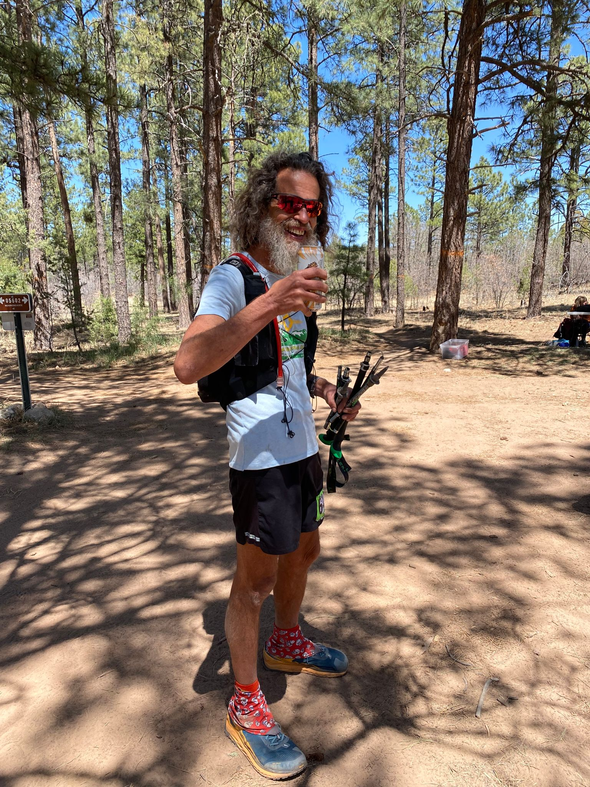

# Cedro Peak 50k

Fasted except for three beers.

My goal for Cedro 50k this year was simply to carry my Cocodona 250 pack and try for an average heart rate of 115 bpm. I wasn't sure that I could do that and still make the cut-offs, so I was prepared to rev my HR higher if necessary.

I was *not* planning on doing it fasted, but I ate like a piggy the afternoon and evening before and decided on race day morning that I had enough calories in me that I'd start out fasted and just eat when I felt like it and I never felt like it.

However, Eric P. (THANKS!) had a 12 oz. 6% ABV Santa Fe [Adobe
Igloo](https://santafebrewing.com/beer/adobe-igloo/) waiting for me at
about mile 24.5, so I broke my fast and had that. Once my fast was
broken it was pointless to resist begging for beer at Spencer B.'s aid
station, where Brian Murray (DOUBLE THANKS) treated me to a 16
oz. 5.1% ABV [Perle Haggard](http://www.exnovobrew.com/perle-haggard)
on my way out and another on my way back.

So, my entire calories before for race day before I reached the finish line were about 0 from the two large cups of Andrew A.'s (TRIPLE THANKS) pre-race coffee and about 600 from the beer.

[Strava claims](https://www.strava.com/activities/7030594890) my
average HR was 119, but I was using the Vertix 2's optical HR and
there are a couple of places where it read anomalously high, so I'm
guessing I did come close to my 115 goal.

With respect to C250, I believe I could easily have done another 18
miles and still felt fresh. I did trip and fall and hit the ground
about a half dozen times (all but one of the *before* I started
drinking beer). Luckily, I sustained no injuries.

My official time was
[8:19:15](https://ultrasignup.com/results_event.aspx?did=90470#id220546),
42nd out of 53 finishers.  In 2019, I ran it in
[6:03:51](https://ultrasignup.com/results_event.aspx?did=60031#id220546)
but I didn't have the Cocodona 250 coming up soon thereafter, and I
had some non-alcohol calories.

Whee!

