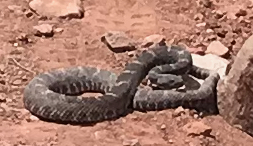
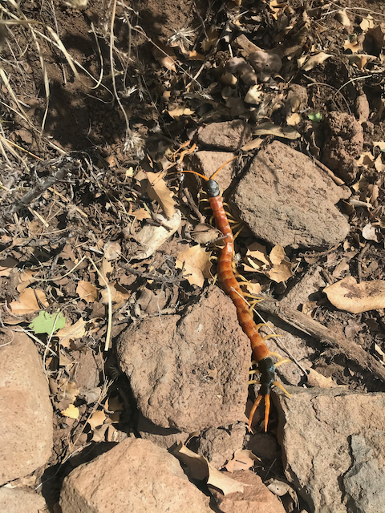
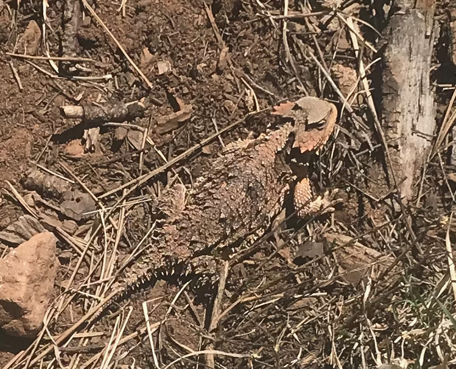

# Rigged!

The Cocodona 250 was rigged[^1] in my favor, and thus I won. At least with
respect to seeing venomous animals. Unfortunately, I currently only
have a photo of two of the trifecta.

Initially, I chose to have my phone off rather than in airplane
mode. It was only when I saw the gila monster that I realized I might
actually see something others wouldn't. I started powering up my
phone, but the monster had left by the time I could take a
picture. Luckily, this was on the first day, so there were other
runners nearby. I pointed the gila monster out to at least one who
took a picture. Maybe someday I'll see it. I didn't, however, think to
get that runner's name or bib number. 

If you took a photo of a gila monster on the first
day&mdash;especially if il mostro was pointed out to you by a guy too
stupid to wear a hat in the sun&mdash;please [contact
me](mailto:clifford.t.matthews@gmail.com).

By the second day, I was running solo mostly. Coming off of Mount
Mingus, there's an interminable trail that is normally fairly
runnable, but had me walking due to a "minor" foot injury. After miles
of not seeing anyone,I saw three participants off the trail and
initially, I couldn't figure out what they were doing. The trail
itself was level, but the land was sloped on either side of it. They
were uphill at an awkward, but not dangerous angle. I thought perhaps
one was taking a poop and the other two were standing guard, but that
didn't make a lot of sense.

> "Caution!" 
"What?" 
"Snake!" 
"What kind of snake?" 
"Rattler!" 
"What kind of rattler?" 
"I don't know!?!" 
"Where?" 
"It's a big snake, next to that big rock and it's not moving!"

It took me a little while to find the medium sized snake next to the
small rock. Furthermore, being tired, I didn't process "it's not
moving" as "it's standing it's ground"; I was thinking more like
"perhaps it's dead." Nope. It was a healthy adult [Mojave
rattler](https://www.youtube.com/watch?v=feqD7ikbyOY&t=86s). I got out
my phone, got close enough to get a low-resolution picture, spoke
calmly to it, then walked widely around it. I stayed on the trail, but
I believe I was well outside its
[striking](https://youtu.be/yUk5y35MukU?t=67) distance.

> "What the fuck? That snake was threatening us. Why wasn't it threatening him?" 
"Maybe he's a snake whisperer"

Heh. I was tempted to shout back that it was OK, because although I'm
young, I was actually doing this year's Cocodona 250 sober and
rattlesnakes bite young _drunk_ men.

The following day I was hiking up the penultimate big climb and I saw
a centipede. Although I know the difference between diamondback,
timber and Mojave rattlers, I didn't know much about various
centipedes. I had a vague recollection of seeing a video of someone
getting bitten by one, but I got a photo and video of the large
colorful one I saw. Once I had a chance to search the web, sure enough,
I had seen a giant desert centipede,
which was indeed the species that [Coyote Peterson had bite
him](https://www.youtube.com/watch?v=-6vzjjIrRK8&t=829s).

I also saw a horned toad. They're common, and they're not venomous,
but they can squirt blood from their eyes. It's also amazing how
camouflaged they are.

FTR, I did not hear of any bites or stings, nor did I see anyone
"attacked" by teddy bear cholla, but there was some teddy bear cholla
out there on the first day. I've run the Javelina Jundred eleven times
and I'd guess about a third of the times I've seen someone with at
least a few balls stuck to them. Once again, [Coyote Peterson
illustrates](https://youtu.be/dJzTse9Dsaw?t=29).

I've done a bunch of running in the Arizona and New Mexico desert and
I've seen rattlesnakes (mostly diamondbacks) before. I don't recall
seeing a gila monster, but I do have a poor memory. I have seen
centipedes every once in a while, but there's no fucking way I'd see
all three in a single race if it weren't rigged. Come on! I'm not
stupid!

[^1]: Pretty much every online poker site is accused of being juiced,
where they rig the game in favor of someone or other for …
reasons. I actually play on the site I created and I play well
enough that I have very good statistics. The people I play with
know (I think!) that I’d never rig it or cheat in any way, but
they will write “rigged!” when someone gets especially lucky,
especially if that someone is I.
