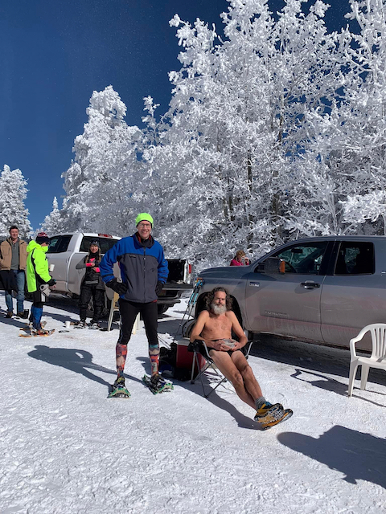

# Sandia Snowshoe Race
## Overview
[I](https://runsignup.com/Race/Results/121254/IndividualResult/dgfR?resultSetId=363582#U27103220)
was the first person sixty years or older to finish.  That meant I won
the male 60-69 age group &lt;cough>_tallest midget_&lt;/cough> award.
[I chose a nice chair from REI as my
prize](https://youtu.be/S2y3KjIPAZo?t=565).  Thanks!

I finished [9th overall in 37:50:12](https://runsignup.com/Race/Results/121254#resultSetId-363582).  I forgot to turn my GPS watch
off after crossing the
finish line, but I used Strava's cropping function to come up with a [GPX
track](https://www.strava.com/activities/8429966466) that's close enough..

## The Race
I ran, blew up, walked, ran, walked, ran, walked, took my polypro
jacket off, ran some more and eventually finished.

If I hadn't worn my jacket, and had I brought a handheld and my iPod
touch, I could have shaved a minute or two off my finish time and
perhaps gaining a rank or two.  IOW, I was a big baby once again this
year, although I don't think I would've beaten
[Andy](https://ultrasignup.com/results_participant.aspx?fname=Andrew&lname=Gray)
and I **know** I couldn't have beaten [Brett](https://ultrasignup.com/results_participant.aspx?fname=Brett&lname=Sanborn).  

## Aftermath
I drove home earlier than I normally do, because I was nervous about the conga
line down the mountain in general and my truck's broken windshield
defroster in specific.

I saw three cars stuck in snow with various people trying to help get
the cars out. I'd stop and help, but the snow shovel that I
kept in my truck for years was stolen a while back and I haven't had the
money to get a replacement.  Additionally, I ~~kind of~~ had to pee **real badly**[^1].

## Thank You

Thank you, [Friends of the Sandia
Mountains](https://friendsofthesandias.org/).  This is an excellent
race and next year I'll run the entire thing.  ~~Honest!~~ Maybe!

## Background

Only half-jokingly, I call this the toughest race I do each year.  I stole
that from my brother-in-law, but it's definitely true when toughest takes
into consideration both the intensity of the effort and just how slowly and
pitifully I move with that effort.

The course has changed over the years.  This year was a new course, although
it _may_ have been the same course as last year.  I didn't get a good GPX
track last year and my memory is not good enough to know.  My brother-in-law
and sister both did the course last year, but not this year. Regardless, the
general pattern is hat it starts out downhill, then has some rollers, then
finishes going uphill.

Each year, in theory, I plan to push myself **hard**, but something comes up
and I half-ass it.  This year I was healthy and basically injury free (I
have a hot-spot on my right foot, but it never spoke up during the race), but
it was surprisingly cold.  I pulled into the parking lot at about 9:10 and
it was six degrees Fahrenheit.  I don't remember it ever having been that cold
and I've done this race every year it's been held since at least 2012 and
probably a few years prior to that.

After I had drunk my pre-race quad espresso, they announced that the
start would be delayed a half hour.  It was taking longer than expected
for people to make it to the top, because the roads were dicey.

On the drive up, just above the Ski Area Parking there was a sign that
said "Chains required beyond this point".  I didn't have chains, nor
did anyone else I saw.  I did have four wheel drive, but to be honest,
I hadn't tested it since I had a [new transfer
case](../2022/big_cottonwood_marathon.md#friday-morning-moab-to-spanish-fork)
(and drive train) installed back in September.

During the thirty minute hold, I texted my wife, sister and brother-in-law.
I started with a picture of my car's thermometer reading 6F.  I then mentioned
some of my concerns about the ride down.  I idled my truck and turned the
heater on, but that meant that I could no longer trust the thermometer to
tell me the outside temperature.  So, by the time to head to the start line
again I chose to err on the side of caution and wore far too much clothing:
a long-sleeve T-shirt, arm-bands and a polypro jacket on my chest, running
shorts and my lightest tights on my legs.

[^1]: Karma. Had I hung around until the end and then volunteered to
help clean up, I would have had plenty of time for relief.
Heck, if I had stopped to help with even one of the three vehicles, I could
have gone then.
