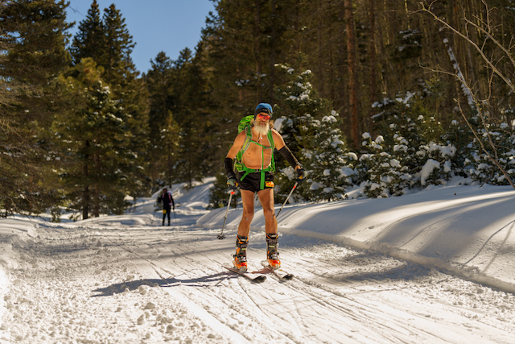

# Mt. Taylor Winter Quadrathlon

This is just the beginning.  More later.

> Is it Tom?

> No. Mike.

> I do this every year, don't I?

> Yup.

Sure enough, I've parked in the same spot three years in a row and Michael
Mills has been right next to me.  He used to be (and perhaps still is) on
Albuquerque Mountain Rescue Council (AMRC), the Search-And-Rescue (SAR)
team that literally does the heavy lifting nearby.  I spent ten years as
a member of Cibola Search and Rescue and was on a few missions with Mike
back in the day, but still I got his name wrong&hellip;three years in a row.

A little while later, Leigh said hi.  She too was (and may still be)
on AMRC.

### Dustin, Julie and Barry

At check-in, I ran into Dustin and Julie.  I think I ran into Barry
then, too.  I certainly saw Barry before the start of the race.  I ran
into (and couldn't remember his name) Dan Clark, and many others, too.
However, looking at the results, I see that Dustin and Julie (both
5:45:18) came in less than two minutes after Mike (5:43:19) and managed
to pip Barry (5:45:23) by five seconds.  Dang. That would have been
cool to see, but I've never finished The Quad that quickly and probably
never will.

### Skiing shirtless was an accident.

#### I hadn't even planned on running shirtless.

I had intended to pack my purple JJ100 short-sleeve shirt in my
bike/run transition bag. However, I had a minor last minute emergency
at home before leaving and I wound up not packing a short-sleeve shirt
in either of my drop bags, but I thought I had.

I wound up getting to Grants later than I had planned and by the time
I got my bib, dropped off all my gear and checked in at the hotel, it
was [time to play poker](https://craftpoker.com/), so I did that
rather than review my gear. I didn't think I needed to review my gear
because this was my twelfth and each year I copy my gear list from the
previous year and only make a few changes based on weather.

So, on race day, when I got off my bike, I took off my long sleeve
shirt and was going to put my short sleeve shirt on, then I saw there
wasn't one. I could have just worn my short-sleeve bike jersey, but I
thought I must have accidentally put my short-sleeve shirt in my other
drop bag. I figured I could just run to the ski transition and put it
on there, but ... it wasn't there, either, nor was it in my snowshoe
backpack.

Although it was clearly one more instance of me mismanaging my time,
part of the problem is that about a week out I thought it was going to
be colder this year than last year, but it turned out to be
significantly warmer. I have four different pair of tights/leggings
and I only packed my heaviest ones. That was a mistake, so of course I
was overheated by the time I got off my bike.

# No Free Beer

After the race I was telling people that there was free beer, but since
I'm not drinking, they could have mine. Only there wasn't free beer.  I'm
pretty sure they've done that in the past, but I'm not sure they even had
it last year.  I can't remember, have I mentioned that my memory is bad?
