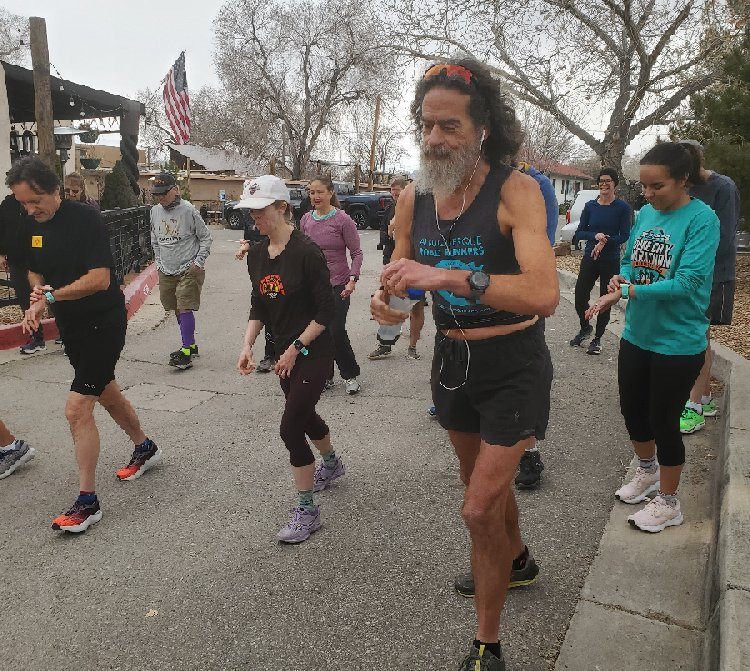

# V Day

[V Day Run](https://www.facebook.com/events/5573661939381690) is the fourth
run of the Burque Brewery Tour.

Overcast, not particularly windy, warm _for me_. The course was new,
but I had been to the [Hops Brewery](https://www.hopsbrewery.com/)
previously with [Team RWB](https://about.teamrwb.org/) after an
invigorating group bike ride.

My big concern was my foot.

Last month, I pushed my Saturday long run to Sunday, so I could race
"[Resolutions Stink!](./resolutions-stink.md)".  For this V Day Run, I
chose to do my long "run" the day before. So, the day prior I "ran"
twenty-four miles with a forty-one pound pack. [It did not go
well](https://www.strava.com/activities/8616423028), and I wound up
taking my shoe and sock off a few times.

With my sock off, I noticed a speck in the center of my hot-spot that
could have been the tip of a goat's head or perhaps it was simply
dried blood where a goat's head had merely stabbed me.  My eyes are
bad enough that it could have been anything.

After finishing my long "run", I used my wife's X-Acto knife and
removed what _appeared to be_ (bad eyesight caveat) some
sort of splinter. Yes, my foot bled a little.  No, I didn't need
stitches.  It did leave my foot a little tender, but I knew that the
following day I'd have the V Day race and would get a chance to test
my handiwork.

I ran fine. My official time was
[23:08](https://www.webscorer.com/racedetails?raceid=306559&did=371483).

### Running with a shirt was an accident.

I had intended to doff my crop-top before the race, but I was too busy
yacking at people.

### Free Beer

I gave my free beer coupon to the Muirheads, whom I've used my scruffy
appearance to scam pity beers from at both the [Black Friday Turkey
Trots](../2022/black_friday.md) and the [Grinch
Lunch](../2022/grinch_lunch.md) earlier in the season. I kept the
penguin.
