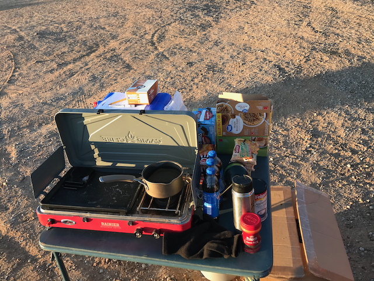

# White Mesa Fat Ass 50k 2023

## Overview

[Sophie
Geernaert](https://ultrasignup.com/results_participant.aspx?fname=Sophie&lname=Geernaert)
and I were the only two to do an entire 50k, but there were [fifteen
signed participants](https://www.webscorer.com/race?raceid=335263)
(and another runner who chose to run without signing up). 

Not only did I get off course, but I [led other people off
course](https://www.youtube.com/watch?v=MYQCb3qrBpo), too.

FWIW, I dubbed this a "[Leisurely White Mesa Fat Ass
50k](https://www.strava.com/activities/10202366309)", because my average
heart rate was only 125. 130 and below is leisurely in my lexicon.

## Sadness

WMFA50k was not only on Veteran's Day this year, but it was also the
day of [Chuck Fuller's Memorial
Service](https://www.abqroadrunners.com/uploads/6/7/7/6/6776981/arr_newsletter_november_2023.pdf#page=4).
I knew Chuck as Dennis Muirhead's Wednesday running partner. I looked
forward to seeing them when our paths intersected.  WMFA50k had
already been on the calendar for months when his memorial was
scheduled, so I had to be there in spirit, which made for a day of
mixed emotions.

## Weather

The weather was excellent, however, a freak snowstorm had hit
Albuquerque the day before and I expected much worse weather for the
event.  I wound up encouraging people who weren't going to do the full
50k to start late, which made it a tiny bit less social, but seemed
like a prudent thing to do at the time.

## Aid

Since I was worried about the temperature, I brought a thermos full of
very hot water, and some "just add hot water" food and beverages:
coffee, hot chocolate and oatmeal. I also made available a few things,
like ramen, that need to be heated for a while in hot water, and to
heat them, a small propane stove and pan.

I don't think _any_ of the heated stuff got consumed, although I do think a
bottle of [Pepsi](https://www.youtube.com/watch?v=MxV-Nyhw_Qs&t=135s) was taken.
I can't be sure, because _I_ was on drugs[^1].

 
 
 

[^1]: [caffeine](https://github.com/ctm/diet/blob/master/log/2023.txt#L13405-L13406) and [endocannabinoids](https://theconversation.com/the-runners-high-may-result-from-molecules-called-cannabinoids-the-bodys-own-version-of-thc-and-cbd-170796)
